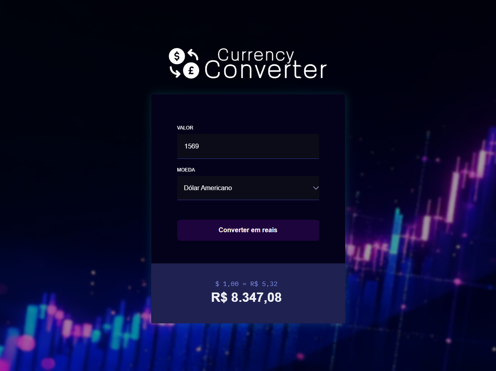

<h1 align="center"> Convert Currency 🗂️ </h1>

Um conversor de moedas estrangeiras para reais, desenvolvido para facilitar cálculos rápidos e precisos de valores monetários.

  <a href="#-tecnologias">Tecnologias</a>&nbsp;&nbsp;&nbsp;|&nbsp;&nbsp;&nbsp;
  <a href="#-projeto">Projeto</a>&nbsp;&nbsp;&nbsp;|&nbsp;&nbsp;&nbsp;
  <a href="#-layout">Layout</a>&nbsp;&nbsp;&nbsp;|&nbsp;&nbsp;&nbsp;
  <a href="#-licença">Licença</a>

  

 

  

## 🤖 Tecnologias

Esse projeto foi desenvolvido com as seguintes tecnologias:

- HTML e CSS
- JavaScript
- Git e Github

## ✨ Funcionalidades

- Conversão de diferentes moedas estrangeiras para reais.
- Interface simples e intuitiva.
- Atualização dinâmica do valor convertido.

## 🛠️ Projeto

O objetivo do projeto é oferecer uma ferramenta prática e acessível para quem deseja saber quanto uma quantia em dólar, euro, libra ou outras moedas vale em reais no câmbio atual.

## 👨‍💻 Autor

Projeto desenvolvido por <a href="https://github.com/fabriciobzrr" target="_blank">Fabricio Bezerra</a>.
Se desejar comentar o projeto ou propor colaborações, estou à disposição!

---

Obrigado por visitar — que este projeto inspire criatividade e evolução contínua.
